# ECG Heart Rate Measurement Algorithm

A small Python signal-processing project for loading ECG data, analyzing
its frequency content, filtering the signal, detecting R-peaks,
calculating heart rate, and validating the detection against reference
annotations.

The project was built step by step as a practical exercise in
**measurement algorithms, digital signal processing, algorithm
verification, and test-driven software development**.

> **Important:** This is an educational engineering project, not a
> medical device and not a clinically validated diagnostic algorithm.

------------------------------------------------------------------------

## 1. Project Overview

The goal is to implement and understand a complete ECG measurement
pipeline:

``` text
ECG Record
    |
    v
Data Loading
    |
    +------> Frequency Analysis (FFT)
    |
    v
Bandpass Filtering
    |
    v
R-Peak Detection
    |
    v
RR Interval Calculation
    |
    v
Heart Rate [BPM]
    |
    v
Reference Annotation Validation
    |
    +--> TP / FP / FN
    +--> Sensitivity
    +--> PPV
    +--> Timing Error
```

The current implementation was first evaluated on [MIT-BIH Arrhythmia
Database Record 100](https://physionet.org/content/mitdb/1.0.0/?utm_source=chatgpt.com) with a sampling frequency of **360 Hz**.


------------------------------------------------------------------------

## 2. Why This Project?

Many measurement systems do more than acquire raw sensor values. They
must convert noisy sampled data into reliable information.

An ECG heart-rate algorithm is a compact example of that workflow:

1.  acquire sampled data,
2.  inspect the signal,
3.  remove unwanted frequency components,
4.  extract an important feature,
5.  calculate a physical/physiological quantity,
6.  compare the result with reference data,
7.  quantify errors,
8.  test the software automatically.

The main learning objective is therefore not simply to calculate a heart
rate. It is to understand the complete path from **raw measurement data
to a validated algorithm result**.

------------------------------------------------------------------------

## 3. ECG Basics

An electrocardiogram (ECG) represents the electrical activity of the
heart over time.

A simplified heartbeat contains several characteristic components:

``` text
                 R
                /\
               /  \
      P       /    \       T
     /\      /      \     /\
____/  \____/        \___/  \____
            Q        S
```

For heart-rate measurement, the **R-peak** is particularly useful
because it is normally a prominent feature of the QRS complex.

The time between two consecutive R-peaks is the **RR interval**.

``` text
       R                       R
       |                       |
       v                       v
      /\                      /\
_____/  \____________________/  \_____
       <------ RR interval ------>
```

Heart rate is calculated from the RR interval:

``` text
Heart Rate [BPM] = 60 / RR interval [s]
```

Example:

``` text
RR = 1.0 s  ->  60 BPM
RR = 0.8 s  ->  75 BPM
RR = 0.6 s  -> 100 BPM
```

------------------------------------------------------------------------

## 4. Dataset

The project uses ECG records and expert annotations from the [MIT-BIH
Arrhythmia Database](https://physionet.org/content/mitdb/1.0.0/?utm_source=chatgpt.com), distributed through PhysioNet.

Typical files for one record are:

``` text
100.dat   -> signal data
100.hea   -> signal header / metadata
100.atr   -> reference annotations
```

For the first full-record evaluation, Record 100 contains:

``` text
Sampling frequency : 360 Hz
Number of samples  : 650000
Duration           : 1805.56 s
                   : approximately 30.1 minutes
```

The Python package [wfdb](https://wfdb.io/) is used to read the signal and annotation
files.

------------------------------------------------------------------------

## 5. Project Structure

``` text
ecg-heart-rate-algorithm/
|
├── data/
│   ├── 100.dat
│   ├── 100.hea
│   ├── 100.atr
│   └── ...
|
├── docs/
│   └── images/
│       ├── raw_ecg.png
│       ├── frequency_spectrum.png
│       ├── raw_vs_filtered_ecg.png
│       ├── r_peak_detection.png
│       ├── instantaneous_heart_rate.png
│       ├── false_positive_analysis.png
│       └── pytest_all_tests.png
|
├── src/
│   ├── __init__.py
│   ├── load_ecg.py
│   ├── frequency_analysis.py
│   ├── filtering.py
│   ├── peak_detection.py
│   ├── heart_rate.py
│   └── validation.py
|
├── tests/
│   ├── test_filtering.py
│   ├── test_heart_rate.py
│   ├── test_peak_detection.py
│   ├── test_pipeline.py
│   └── test_validation.py
|
├── config.json
├── main.py
├── requirements.txt
└── README.md
```

### Responsibilities

  -----------------------------------------------------------------------
  File                                Responsibility
  ----------------------------------- -----------------------------------
  `load_ecg.py`                       Load ECG samples and sampling
                                      frequency

  `frequency_analysis.py`             Transform the signal into the
                                      frequency domain

  `filtering.py`                      Remove unwanted low- and
                                      high-frequency components

  `peak_detection.py`                 Detect candidate R-peaks

  `heart_rate.py`                     Calculate RR intervals and heart
                                      rate

  `validation.py`                     Compare detections with reference
                                      annotations

  `main.py`                           Connect the processing steps

  `config.json`                       Store the selected
                                      record/configuration

  `tests/`                            Unit and integration tests

------------------------------------------------------------------------

## 1. Analyzing ECG samples

The dataset contains **real**, **annotated ECG recordings**. This is particularly valuable because it allows us to compare our detected heartbeats with the reference annotations later on. The first task is to read the ECG samples and the sampling frequency.          


### Samply frequency

The sampling rate for record 100 is $f_{s} = 360 Hz$ . This means that 360 samples are recorded every second.

The sample time at ${f_{s}}$ is :  

$T_{s} = \frac{1}{f_{s}}= 2.78 ~ms$

**The samply frequency $f_{s}$ defines the relationship between sample index and
physical time**. It is required for filter design, frequency analysis, RR
intervals, and timing-error calculation.
         

### Raw ECG (complete record)

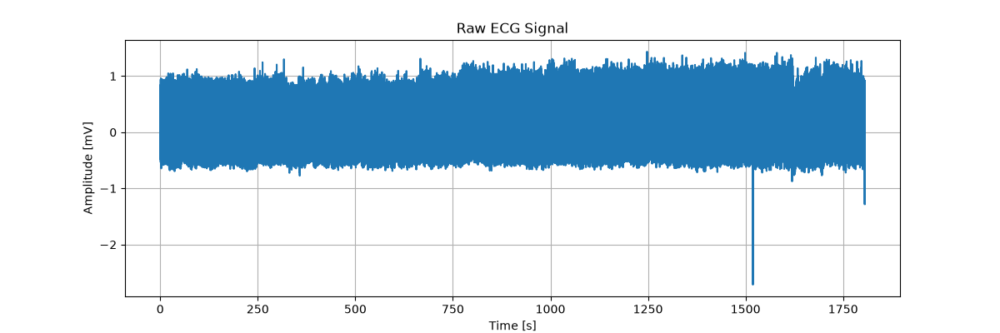

### Raw ECG (10s record)
As there are 650000 samples for this ECG signal we will mostly focus on the analysis  for $Time[s] = [0...10]$ seconds timing for the analysis. 
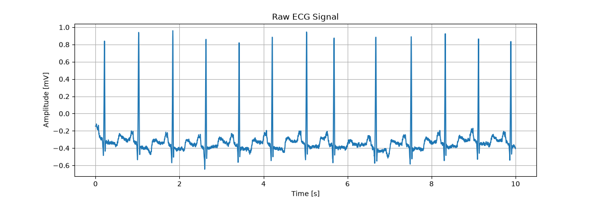

The plot above illustrates **the dominant R-peaks**. These are exactly the ones we want to detect automatically later on.
```
0.2s   1.0s   1.8s   2.6s   3.4s   4.2s ...
 ↑      ↑      ↑      ↑      ↑      ↑
 R      R      R      R      R      R
 ```

We observed that the signal is not centered at 0 mV, but fluctuates roughly around −0.35 mV. This is a good example of why **preprocessing and filtering are important later on**.

### Signal Analysis Results
Here are some basic details out of the ECG full-record evaluation, Record 100 contains:

``` text
===================================
ECG Measurement Algorithm
Record: 100
===================================
Sampling frequency: 360 Hz
Number of samples: 650000
Duration: 1805.5555555555557 seconds
Minimum: -2.715
Maximum: 1.435
Mean: -0.3062989769230769
Standard deviation: 0.19319954213721688
Number of detected R-peaks: 13
```

<!-- 
### Plausibility check
We can roughly estimate the heart rate from the plot. The distance between two R-peaks is approximately:

$RR = 0.8 s$ </br></br>
so </br></br>
$HR = \frac{60}{RR} = 75 BPM$

**So, we need to implement an algorithm which is designed to perform the exact calculation automatically for the entire signal**
-->

------------------------------------------------------------------------

## 2. Frequency Analysis with FFT (Fast Fourier Transformation)

Frequency analysis helps to identify the frequency ranges in which signal components are present and where unwanted components occur. 

The Fast Fourier Transform (FFT) is mostly used **to convert a time-domain signal into a frequency-domain representation**. This is helpful to better understand the choice of filter limits.

``` text
Time Domain                    Frequency Domain

Amplitude                         Magnitude
   |                                  |
   |  /\    /\                        |\
   | /  \__/  \                       | \__
   +-------------> Time              +-------------> Frequency
```


### Frequency Spectrum
Four expriments were done but only the last three for will be taken into consideration, **most of the signal energy lies below about 40 Hz**. Above that, the spectrum becomes increasingly narrow; **starting at about 50–60 Hz**.

**Subtracting the mean value when doing the FFT reduces the DC component at 0 Hz**. This makes it easier to analyse the remaining frequency spectrum, especially for the last three graph for $f[Hz] = [0...50, 0...100, 0...180]$.

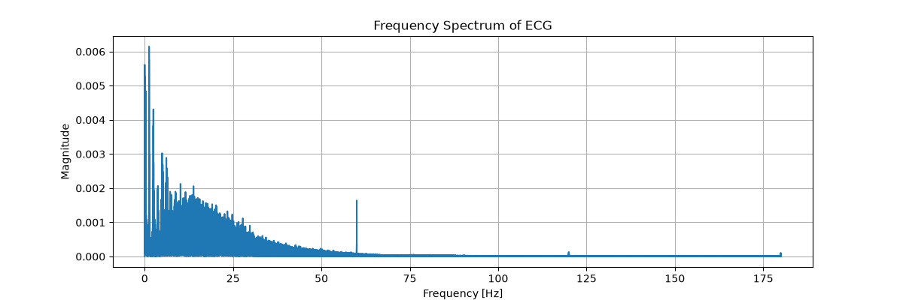
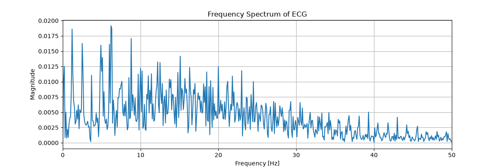
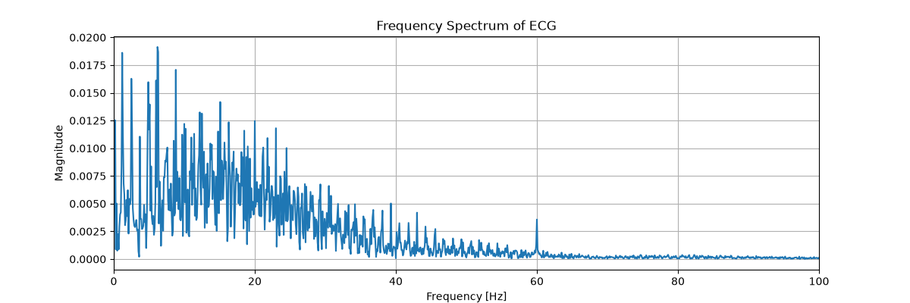
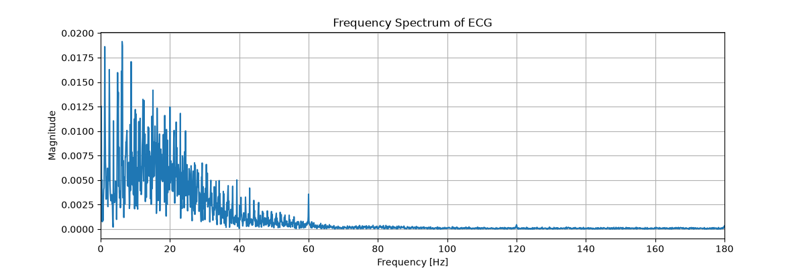

For R-peak detection in Section 4, we want to reduce 
- <span style="color:red">very slow signal components</span> and 
- <span style="color:red">high-frequency noise</span>

------------------------------------------------------------------------

## 3. Bandpass Filtering

The band-pass filter is designed to attenuate very slow signal components or baseline components and higher-frequency noise while retaining the section relevant to the current ECG processing.

The current algorithm applies a **fourth-order Butterworth bandpass filter**. As a starting point for this learning project, we can use a **bandpass filter** with a bandwidth of approximately 

$0.5Hz≤f_{BW}≤40Hz$

The Butterworth filter exhibits a uniform amplitude response in the passband and can be designed in a simple and straightforward manner for this manageable signal processing chain.

``` text
very low             useful ECG range              high frequency
frequencies                                              noise
    |                       |                            |
    v                       v                            v

----X----------------[ 0.5 Hz ===== 40 Hz ]-------------X----
 suppressed                preserved                 suppressed
```

### Nyquist frequency

If an analogue signal is sampled at a sampling frequency $f_{s} = 360 Hz$, the Nyquist frequency is: $f_{N} = \frac{f_{s}}{2} = 180~ Hz$. This means that the analogue signal does not contain any frequency components above this limit prior to sampling.

``` text
                 useful ECG range
                 0.5 – 40 Hz
                     │
        ┌────────────┴────────────┐
        ▼                         ▼

0 Hz    0.5 Hz                   40 Hz               180 Hz
│────────│════════════════════════│────────────────────│
                                                    Nyquist
 ```

The filter **cutoff frequencies** are normalized relative to this value between $0...180 ~Hz$.

### Normalised cut-off frequencies

With this notation, SciPy requires 

$f_{low,norm}= \frac{0.5}{180} ≈0.00278$ 

and 

$f_{high,norm}= \frac{40}{180} ≈ 0.222$</br>

This gives the filter normalised cut-off frequencies between 0 and 1, where
``` text
0.0  →   0 Hz
1.0  →   Nyquist-Frequency = 180 Hz
 ```

The R-peaks should be preserved, while **slow baseline fluctuations** and **higher-frequency noise are reduced**.

###  Raw vs. Filtered ECG

``` text
ECG Sampling Rate
fs = 360 Hz
      │
      ▼
Nyquist Frequency
fN = fs / 2
   = 180 Hz
      │
      ▼
Desired Bandpass
0.5 – 40 Hz
      │
      ▼
Normalisation
      │
      ▼
low  = 0.5 / 180
high = 40 / 180
      │
      ▼
Butterworth Filter
      │
      ▼
Filtered ECG
``` 
The bandpass filter has modified the signal in a meaningful way. **This can be seen in the plot below which illustrated the Raw ECG Vs. Filtered ECG**. Only then will we move on to peak detection to automatically find the R-peaks.

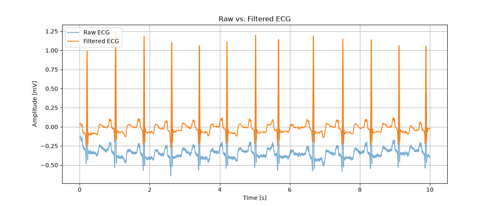

In the graph above we observed that the **filtered signal is shifted vertically relative to the raw signal**. This can generally be explained and is not necessarily an error.

For the raw signal, the baseline is approximately $−0.3$ to $−0.4 ~mV$. The signal therefore has a distinct DC component or offset.

In contrast, after the bandpass filter, the orange curve lies at approximately: $0 mV$. This is a direct consequence of the lower cut-off frequency, for example: $f_{low} = 0.5~ Hz$.

A band-pass filter with a range of approximately $0.5...40~ Hz$ attenuates frequencies below $0.5 ~Hz$. 

This includes, in particular, the DC component: $f_{DC} =0~Hz$. That is why the negative offset of the raw signal disappears.

------------------------------------------------------------------------

## 4. R-Peak Detection

a typical heartbeat on an ECG consists of

```text
Amplitude
   │
   │                 R
   │                /\
   │               /  \
   │      P       /    \          T
   │     /\      /      \        /\
───┼────/──\────/────────\──────/──\────
   │           Q          S
   │
   └───────────────────────────────→ Zeit
```
The R-peak is the prominent peak of the QRS complex. 

When it comes to heart rate, what we need above all is its position over time.

```text
        R1             R2             R3
        │              │              │
        ▼              ▼              ▼
        /\             /\             /\
_______/  \___________/  \___________/  \______

        <----- RR ----->
```
From two peak positions:

$RR = \frac{R_{2} - R_{1}}{f_{s}}$

and then:

$HR = \frac{60}{RR}$

### How does R-Peak detection works
For the R-Peak detection two important parameters are used.

- Minimum distance: What is the minimum distance between two peaks?
- Prominence: How clearly must a peak stand out from its surroundings?


**Why isn’t ‘find all maxima’ enough?**
An ECG contains many local maxima

```text
                  R
                 /\
        P       /  \            T
       /\      /    \          /\
______/  \____/      \________/  \____
       ↑        ↑               ↑

     lokales   R-Peak          lokales
     Maximum                   Maximum
```
If we were simply to accept every local maximum, then, for example,

- P-waves
- T-waves
- Noise
- Motion artefacts
- Other signal peaks

might be incorrectly identified as heartbeats. That is why we need criteria.


### Minimum distance
Two detected R-peaks must be at least $0.5~s$ apart. That is why the algorithm must determine as reliably as possible: 

**Where is each R-peak located?**

The minimun distance is  $0.5~s * 360 *\frac{samples}{s} = 180~ samples$

Let’s assume that the algorithm sees:
```text
Sample:

100       200   250              500
 │         │     │                │
 ▼         ▼     ▼                ▼
 /\        /\    /\               /\
/  \      /  \  /  \             /  \
```
There may be only the following difference between two candidates $250 - 200 = 50 ~samples < 180 ~samples$

The aim is to ensure that they do not both remain as distinct peaks. This is particularly helpful in preventing multiple local peaks within a short period of time from being interpreted as multiple heartbeats.

### Prominence
prominence describes how strongly a peak stands out relative to its
surrounding signal.

**Why is Prominence useful for ECG?**
After the band-pass filter, the signal might look something like this, for example
```text
                         R
                        /\
                       /  \
        kleine        /    \
        Störung      /      \
          /\        /        \
_________/  \______/          \_______

          ↑             ↑

    low               high
    prominence        prominence
```
By setting prominence to $0.5$ we only accept peaks that stand out clearly enough from their surroundings.This means that minor fluctuations and noise are more likely to be filtered out.

**That is the most important point. We don’t have two completely independent tricks, but rather two criteria that solve different problems**:

```text
Filtered ECG
     │
     ▼
local Maxima
     │
     ├── Is the prominence sufficient?
     │
     │        No → reject
     │
     ▼ Yes
Was the minimum distance maintained??
     │
     │        No → Dealing with competing peaks
     │
     ▼ Yes
Detected R-Peak
```

### Detected R-Peaks (complete and 10s record)
In the screenshot below we observe the dominant R-peaks are highlighted. That means the R-peak detection works fine, so there are no any obvious false positives or missing peaks. 

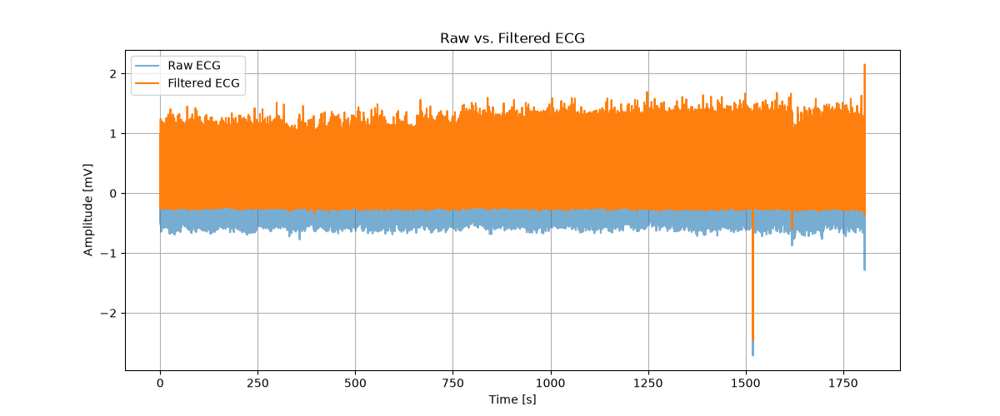
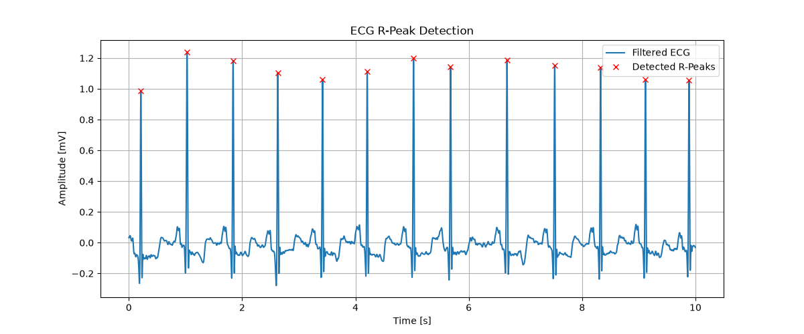


------------------------------------------------------------------------

## 5. RR Intervals

```text
     R           R            R
     ×           ×            ×
____/ \_________/ \__________/ \____

   Peak 1      Peak 2       Peak 3
     │           │            │
     └── RR1 ────┘
                 └── RR2 ─────┘
```

Once the R-peaks are known, the sample distances between consecutive
peaks are calculated:

Example:

$R_{peak_{1}} = sample ~ 250$

$R_{peak_{2}} = sample ~540$

by considering $f_{s}= 360 ~Hz$

$d_{difference} = R_{peak_{2}} - R_{peak_{1}} = 290 ~samples $

so by having the RR interval in seconds is  $RR = \frac{d_{difference}}{f_{s}} = 0.806 ~s$ 

we cann determine the Heart Rate $HR = \frac{60}{RR} = 74.4 ~BPM s$

Before we switch to the Heart Rate calculation we need to clarify that the number of detected R-peaks $N_{R} = 13$ totally differs from the number of calculated interval $N_{RR} = 12$ 

$N_{RR} = N_{R} - 1$

``` text
R1     R2     R3     R4
│      │      │      │
└─RR1──┘      │      │
       └─RR2──┘      │
              └─RR3──┘

4 R-Peaks
      ↓
3 RR-Intervalle
``` 


------------------------------------------------------------------------

## 6. Heart Rate Calculation

The instantaneous heart rate is determined as follows

### Instantaneous Heart Rate (complete record)
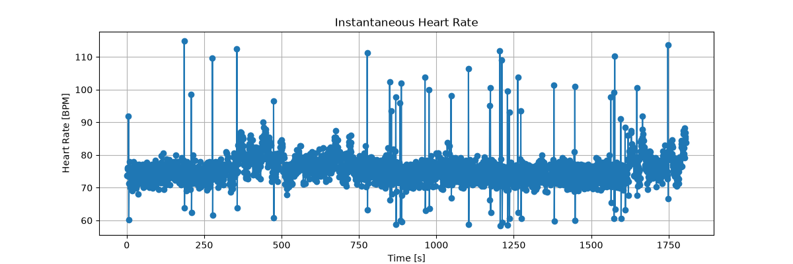

```text
--- Heart Rate Analysis ---
Mean RR Interval: 0.794593603286385 s
Mean Heart Rate: 75.80764604749777 BPM
Mean instantaneous HR: 75.80764604749777 BPM
HR from mean RR: 75.51029828561933 BPM
```

### Instantaneous Heart Rate (10s record)
The plot shows a predominantly steady rate of around **73–78** BPM, with two notable peaks at **92 BPM** and **60 BPM**. These two outliers are particularly interesting. They could be genuine RR variability or an indication that we have misclassified a peak. **This is precisely why we should not simply assume that the algorithm is correct, but should check it against the reference annotations from the MIT-BIH dataset**.

For the full Record 100 evaluation:
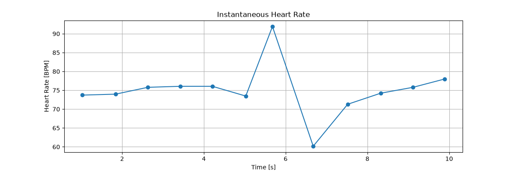

```text
--- Heart Rate Analysis ---
Mean RR Interval: 0.8060185185185184 s
Mean Heart Rate:75.03567059678025 BPM
Mean instantaneous HR: 75.03567059678025 BPM
HR from mean RR: 74.43997702469846 BPM
```
------------------------------------------------------------------------

# 7. Ground-Truth Validation

- **How do we know that the identified R-peaks are actually correct?**
The dataset Record 100 contains the file 100.atr with reference annotations. In the next step, we can therefore validate our detection quantitatively against the ground truth.


Detecting peaks is not enough. The result must be compared against
reference annotations.

The validation classifies  **three detections** into:

``` text
TP = True Positive
     detected peak matches a reference beat

FP = False Positive
     detected peak has no matching reference beat

FN = False Negative
     reference beat was missed
```

``` text
REFERENCE                 DETECTION

    R                         ×
    │                         │
────┼─────────────────────────┼────
       distance < Tolerance

              TRUE POSITIVE
                    TP
```
then

``` text
REFERENCE                 DETECTION

                              ×
                              │
──────────────────────────────┼────

                   FALSE POSITIVE
                        FP
```

and

``` text
REFERENCE

    R
    │
────┼───────────────────────────────

        No Detection

         FALSE NEGATIVE
               FN
```

**A detection is accepted as a match when it lies inside a defined timing
tolerance around a reference annotation**.

Current default: 

Tolerance = $\pm 50 ~ms$

At $f_{s} = 360 ~Hz$:

$\pm 0.5 * f_{s} = \pm 18 ~samples$

We therefore accept a detected peak as a match **if it is no more than approximately $\pm 18 ~samples$ away from the reference**.

```text
Reference
    │
    ▼
----|-----------------------------
    R
    ▲
 ±18 Samples
<------------>

      × Detected
      │
      └── within → True Positive
```


This enables us to then determine $TP$, $FP$ and $FN$. We can then determine metrics such as:
- **Sensitivity**, 
- **Positive predictive value** and
-  **Timing error**.

And the two conspicuous points at around $T=5.7s$ and $T=6.7s$ on the heart rate plot are particularly interesting: 
using the **ground truth**, we can determine whether there are actually **unusual RR intervals** there or **whether our algorithm is responsible for them**.

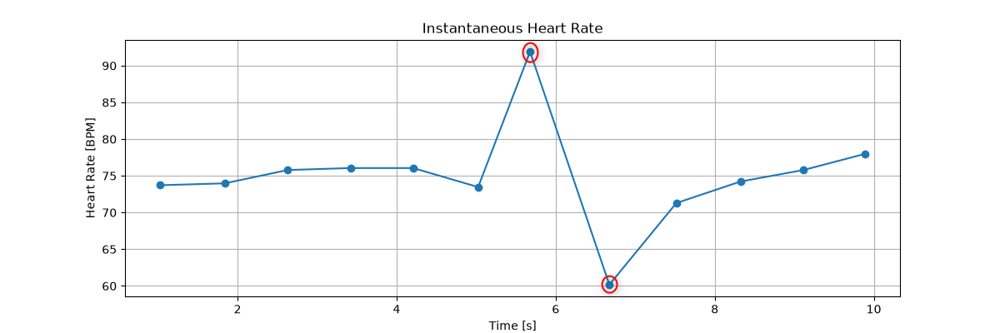

```text
Detected     Reference 
   77            77 
  370           370 
  662           662 
  947           946 
 1231          1231 
 1515          1515 
 1809          1809 
 2044          2044 
 2403          2402 
 2706          2706 
 2997          2998 
 3282          3282 
 3559          3560 
```

Now we can see something important: **the detection matches the reference positions almost perfectly. For these peaks the detector is at most about $2.8~ms$ away from the annotation**. That's a very good result.

------------------------------------------------------------------------

## 8. Evaluation Metrics

### Sensitivity

Sensitivity measures how many reference beats were detected:

$Sensivity = \frac{TP}{TP + FN}$

A missed beat increases $FN$ and therefore reduces sensitivity.

### Positive Predictive Value (PPV)

PPV measures how many algorithm detections were correct:

$PPV = \frac{TP}{TP + FP}$

An additional incorrect detection increases $FP$ and therefore reduces
PPV.

### Timing Error
The timing error is **particularly important in this project because it does not indicate whether a heartbeat has been detected, but rather how accurately its timing has been determined**.
```text
Detected     Reference     Deviation
   77            77             0
  370           370             0
  662           662             0
  947           946            +1
 1231          1231             0
 1515          1515             0
 1809          1809             0
 2044          2044             0
 2403          2402            +1
 2706          2706             0
 2997          2998            -1
 3282          3282             0
 3559          3560            -1
```
The timing errors are intepreted as follows:
- 9 Peaks exactly on the reference sample
- 2 Peaks shifted by +1 sample
- 2 Peaks shifted by -1 sample
- no peak is more than 1 sample away


So the algorithm correctly detected the heartbeat, but it was offset by 1 sample. The signed timing error is:

$E = sample_{detected} - sample_{reference} = 947 - 946 = +1$

$+1$ means the algorithm located the peak one sample later. If the $sample_{detected}$ were $642$, for example, the error $E$ would be $0$ sample, i.e. one sample earlier


Given the sampling rate of $f_{s} = 360 ~Hz$, one sample corresponds to $2.78~ms$

This means that a timing error $T_{Error_{ms_{1}}}$ of 1 sample corresponds to approximately $(\frac{1}{f_{s}})*1000 = 2.78~ms$, and 2 samples to approximately $T_{Error_{ms_{2}}} = 2* \frac{1000}{f_{s}} = 5.56~ms$.

It is important to distinguish between **sensitivity** and **PPV**. sensitivity and PPV assess whether the correct beats have been detected. The **timing error** assesses, for correctly matched beats, how precisely their position has been determined.


------------------------------------------------------------------------


# 9. Record 100 Results

In this section, the complete Record 100 was processed rather than only a short signal
segment. **That means the 10 seconds timing is no longer considered from this section on**.

| Category | Metric | Result |
|:---|:---|---:|
| **Signal** | Sampling Frequency | 360 Hz |
| | Number of Samples | 650,000 |
| | Signal Duration | 1805.56 s (~30.1 min) |
| **Beat Detection** | Reference Beats | 2,272 |
| | Detected R-Peaks | 2,273 |
| **Detection Performance** | True Positives (TP) | **2,272** |
| | False Positives (FP) | **1** |
| | False Negatives (FN) | **0** |
| | Sensitivity | **100.00 %** |
| | Positive Predictive Value (PPV) | **99.956 %** |
| **Timing Accuracy** | Mean Absolute Error | **0.144 samples** |
| | Maximum Error | **2 samples** |
| | Mean Absolute Error | **0.401 ms** |
| | Maximum Error | **5.56 ms** |


### Interpretation

For this specific record, all **2,272 reference beats were matched by the
algorithm**.

``` text
FN = 0
-> Sensitivity = 100 %
```

One additional peak was detected:

``` text
FP = 1
-> PPV = 99.956 %
```

These values describe **Record 100 only**. They must not be interpreted
as general or clinical performance claims.


- **What happens if the minimum distance is too small?**

- **What happens if the minimum distance is too large?**

- **Why is Prominence useful for ECG?**

- **What happens if the Prominence is too small?**

------------------------------------------------------------------------

# 10. False-Positive Root-Cause Analysis

Instead of changing the detector threshold until the false positive
disappeared, the error was investigated.

The false positive was located at:

``` text
Sample : 546888
Time   : 1519.13 s
       : approximately 25 min 19 s
```

### Local Signal View

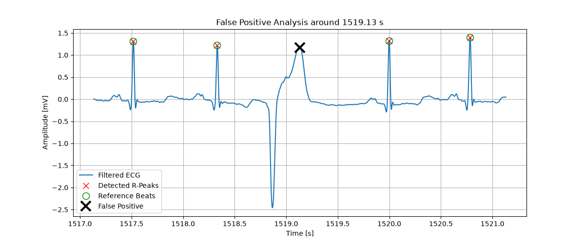

The signal around the false positive contains **an unusual high-amplitude
morphology**: a strong negative deflection followed by a broad positive
deflection.

The positive part satisfies the current prominence-based peak criterion.
Because no selected reference beat is matched at that position, **the
validation correctly classifies the detection as a false positive**.

### Engineering conclusion

The error illustrates a limitation of a simple prominence-based R-peak
detector:

``` text
High/prominent signal feature
          |
          v
find_peaks() criterion satisfied
          |
          v
candidate R-peak
          |
          v
no reference match
          |
          v
False Positive
```

This is useful information for future algorithm improvement.

------------------------------------------------------------------------

# 11. Automated Testing

The project uses **pytest**.

The tests were developed at two levels.

## Unit Tests

Individual functions are tested independently.

### Heart-rate tests

Examples:

``` text
RR = 1.0 s -> 60 BPM
RR = 0.8 s -> 75 BPM
```

The RR-interval conversion is also tested using known R-peak sample
positions.

### Filter test

A synthetic signal contains:

``` text
0.2 Hz  -> below passband
10 Hz   -> inside passband
80 Hz   -> above passband
```

Expected behavior:

``` text
0.2 Hz  -> attenuated
10 Hz   -> preserved
80 Hz   -> attenuated
```

### Peak-detection tests

Synthetic signals contain peaks at known sample positions.

The tests verify:

-   known peaks can be detected,
-   the minimum peak-distance rule is respected.

### Validation tests

Controlled arrays are used to create known TP, FP and FN cases.

Example:

``` text
Reference: [360, 720, 1080]
Detected : [360, 720, 900]

360  -> TP
720  -> TP
900  -> FP
1080 -> FN

Expected:
TP = 2
FP = 1
FN = 1
```

------------------------------------------------------------------------

## Integration Test

The integration test verifies several modules together:

``` text
Synthetic ECG-like signal
          |
          v
bandpass_filter()
          |
          v
detect_r_peaks()
          |
          v
calculate_rr_intervals()
          |
          v
calculate_heart_rate()
          |
          v
Expected RR and BPM
```

Smooth synthetic QRS-like pulses are used instead of single-sample
impulses because the signal must also pass through the bandpass filter.

------------------------------------------------------------------------

## Current Test Status

``` text
10 tests collected
10 tests passed
```

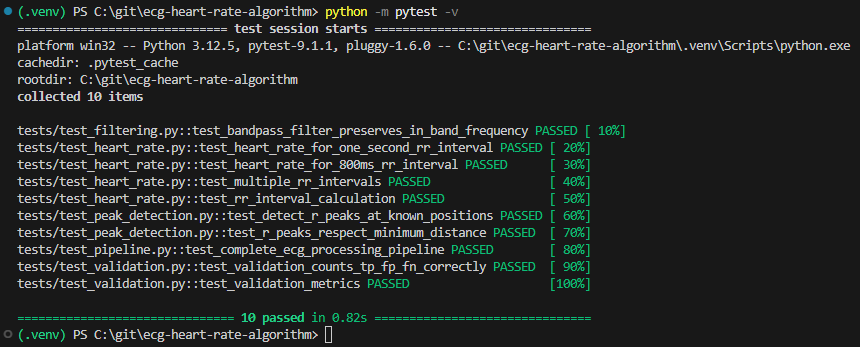

Current coverage by test count:

``` text
test_heart_rate.py       4 tests
test_filtering.py        1 test
test_peak_detection.py   2 tests
test_validation.py       2 tests
test_pipeline.py         1 integration test
                         --------
                         10 tests
```

------------------------------------------------------------------------

## Why use synthetic data for unit tests?

Real ECG data is complex. If a test fails on a real record, many
different parts of the system could be responsible.

Synthetic data allows the expected result to be known before running the
algorithm.

Example:

``` text
Known peaks:
[360, 720, 1080]

          |
          v

detect_r_peaks()

          |
          v

Expected:
[360, 720, 1080]
```

This isolates the behavior of one function.

------------------------------------------------------------------------

## Why use real data as well?

Synthetic tests demonstrate that the implementation behaves correctly
under controlled conditions.

Real annotated ECG records test whether the algorithm also works on
realistic signal morphology.

Therefore both are useful:

``` text
Synthetic data
    |
    +--> controlled verification

Real annotated ECG
    |
    +--> realistic algorithm evaluation
```

------------------------------------------------------------------------

# 12. Current Limitations

This project intentionally starts with a simple and understandable
algorithm.

Current limitations include:

1.  **Simple prominence-based peak detection**\
    The detector does not explicitly classify QRS morphology.

2.  **Initial full-record result is based on Record 100**\
    More records are required before making statements about general
    robustness.

3.  **Fixed detector parameters**\
    `prominence` and minimum distance are currently fixed.

4.  **Limited handling of unusual morphology and artifacts**\
    The false-positive analysis demonstrates this limitation.

5.  **Not clinically validated**\
    The project is an engineering/learning implementation, not
    diagnostic software.

------------------------------------------------------------------------

# 13. Planned Improvements

The next development steps are:

``` text
1. Freeze current parameters
        |
        v
2. Evaluate additional MIT-BIH records
        |
        v
3. Build a multi-record result table
        |
        v
4. Analyze FP and FN cases
        |
        v
5. Identify recurring failure mechanisms
        |
        v
6. Improve the detector based on evidence
        |
        v
7. Re-run regression tests
```

Possible technical improvements include:

-   evaluation on multiple records,
-   automated batch evaluation,
-   CSV/JSON result export,
-   additional signal-quality checks,
-   adaptive detection thresholds,
-   more QRS-specific feature extraction,
-   improved handling of abnormal morphologies,
-   automated generation of evaluation plots,
-   code coverage reporting,
-   continuous integration for automated tests.

------------------------------------------------------------------------

# 21. Disclaimer

This repository is an educational and portfolio project for software and
signal-processing development. It is **not intended for diagnosis,
treatment decisions, patient monitoring, or other clinical use**.
